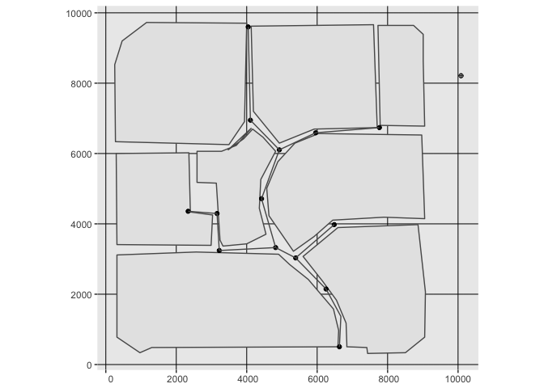
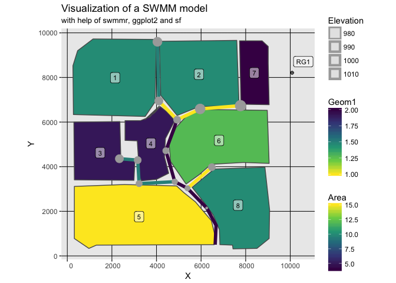

<!-- README.md is generated from README.Rmd. Please edit that file -->
swmmr
=====

[](https://cran.r-project.org/package=swmmr) [](https://travis-ci.org/dleutnant/swmmr)

Functions to connect the widely used [Storm Water Management Model (SWMM)](https://www.epa.gov/water-research/storm-water-management-model-swmm) of the United States Environmental Protection Agency (US EPA) to R with currently two main goals: (1) Run a SWMM simulation from R and (2) provide fast access to simulation results, i.e. SWMM's binary '.out'-files. High performance is achieved with help of Rcpp. Additionally, reading SWMM's '.inp'-files is supported to glance model structures.

Installation
------------

Installation is easy thanks to CRAN:

``` r
install.packages("swmmr")
```

You can install the dev version from github with:

``` r
# install.packages("devtools")
devtools::install_github("dleutnant/swmmr@dev")
```

Example
-------

This is a basic example which shows you how to work with the package. We use the example shipped with the SWMM5 executable.

### Initiate a SWMM run and retrieve simulation results

``` r

library(swmmr)
library(purrr) # to conveniently work with list objects

# set path to inp (avoid white spaces in file paths!)
inp_path <- "~/EPA_SWMM_Projects/Examples/Example1.inp"

# glance model structure, the result is a list of data.frames with SWMM sections
inp <- read_inp(x = inp_path)

# available SWMM sections
summary(inp)
#>               Length Class  Mode
#> title          1     tbl_df list
#> options        2     tbl_df list
#> evaporation    2     tbl_df list
#> raingages      5     tbl_df list
#> subcatchments  9     tbl_df list
#> subareas       8     tbl_df list
#> infiltration   6     tbl_df list
#> junctions      6     tbl_df list
#> outfalls       6     tbl_df list
#> conduits       9     tbl_df list
#> xsections      8     tbl_df list
#> pollutants    11     tbl_df list
#> landuses       4     tbl_df list
#> coverages      3     tbl_df list
#> buildup        7     tbl_df list
#> washoff        7     tbl_df list
#> report         2     tbl_df list
#> map            2     tbl_df list
#> coordinates    3     tbl_df list
#> vertices       3     tbl_df list
#> polygons       3     tbl_df list
#> symbols        3     tbl_df list

# for example, inspect section subcatchments
inp$subcatchments
#> # A tibble: 8 x 9
#>    Name `Rain Gage` Outlet  Area Perc_Imperv Width Perc_Slope CurbLen
#>   <int>       <chr>  <dbl> <dbl>       <dbl> <dbl>      <dbl>   <dbl>
#> 1     1         RG1      9    10          50   500       0.01       0
#> 2     2         RG1     10    10          50   500       0.01       0
#> 3     3         RG1     13     5          50   500       0.01       0
#> 4     4         RG1     22     5          50   500       0.01       0
#> 5     5         RG1     15    15          50   500       0.01       0
#> 6     6         RG1     23    12          10   500       0.01       0
#> 7     7         RG1     19     4          10   500       0.01       0
#> 8     8         RG1     18    10          10   500       0.01       0
#> # ... with 1 more variables: Snowpack <lgl>

# run a simulation
# the result is a named list of paths, directing
# to the inp, rpt and out-file, respectively.
files <- run_swmm(inp = inp_path)
#> arguments 'minimized' and 'invisible' are for Windows only

# we can now read model results from the binary output:
# here, we focus on the system variable (iType = 3) from which we pull
# total rainfall (in/hr or mm/hr) and total runoff (flow units) (vIndex = c(1,4)).
results <- read_out(files$out, iType = 3, vIndex = c(1, 4))
#> Warning in strptime(xx, f <- "%Y-%m-%d %H:%M:%OS", tz = tz): unknown
#> timezone 'default/Europe/Berlin'

# results is a list object containing two time series 
str(results, max.level = 2)
#> List of 1
#>  $ system_variable:List of 2
#>   ..$ total_rainfall:An 'xts' object on 1998-01-01 01:00:00/1998-01-02 12:00:00 containing:
#>   Data: num [1:36, 1] 0.25 0.5 0.8 0.4 0.1 ...
#>   Indexed by objects of class: [POSIXct,POSIXt] TZ: GMT
#>   xts Attributes:  
#>  NULL
#>   ..$ total_runoff  :An 'xts' object on 1998-01-01 01:00:00/1998-01-02 12:00:00 containing:
#>   Data: num [1:36, 1] 0 6.22 13.03 24.25 14.17 ...
#>   Indexed by objects of class: [POSIXct,POSIXt] TZ: GMT
#>   xts Attributes:  
#>  NULL

# basic summary
results[[1]] %>% purrr::map(summary)
#> $total_rainfall
#>      Index                        .x[[i]]       
#>  Min.   :1998-01-01 01:00:00   Min.   :0.00000  
#>  1st Qu.:1998-01-01 09:45:00   1st Qu.:0.00000  
#>  Median :1998-01-01 18:30:00   Median :0.00000  
#>  Mean   :1998-01-01 18:30:00   Mean   :0.07361  
#>  3rd Qu.:1998-01-02 03:15:00   3rd Qu.:0.00000  
#>  Max.   :1998-01-02 12:00:00   Max.   :0.80000  
#> 
#> $total_runoff
#>      Index                        .x[[i]]       
#>  Min.   :1998-01-01 01:00:00   Min.   : 0.0000  
#>  1st Qu.:1998-01-01 09:45:00   1st Qu.: 0.0000  
#>  Median :1998-01-01 18:30:00   Median : 0.0000  
#>  Mean   :1998-01-01 18:30:00   Mean   : 2.1592  
#>  3rd Qu.:1998-01-02 03:15:00   3rd Qu.: 0.1033  
#>  Max.   :1998-01-02 12:00:00   Max.   :24.2530

# basic plotting
results[[1]] %>% purrr::imap( ~ plot(.x, main = .y))
#> $total_rainfall
```


    #> 
    #> $total_runoff


### Visualize the model structure

``` r
# With help of packages 'ggplot2' and 'sf' we can easily plot swmm objects:
# There is a default plot function which provides a fast way to visualize your 
# model, i.e. it plots subcatchments, junctions, links and raingages
library(ggplot2) # (>= 2.2.1.9000)
library(tidyverse)
#> Loading tidyverse: tibble
#> Loading tidyverse: tidyr
#> Loading tidyverse: readr
#> Loading tidyverse: dplyr
#> Conflicts with tidy packages ----------------------------------------------
#> filter(): dplyr, stats
#> lag():    dplyr, stats
library(sf)
#> Linking to GEOS 3.6.1, GDAL 2.1.3, proj.4 4.9.3

plot(inp)
```



``` r

# Because of the underlying ggplot structure, we can individually plot and highlight 
# swmm objects:
# convert subcatchments to sf geometry
sub_sf <- subcatchments_to_sf(inp)
# convert links
lin_sf <- links_to_sf(inp)
# convert junctions
jun_sf <- junctions_to_sf(inp)
# convert raingages
rg_sf <- raingages_to_sf(inp)

# calculate coordinates (centroid of subcatchment) for label position
lab_coord <- sub_sf %>% 
  sf::st_centroid() %>%
  sf::st_coordinates() %>% 
  tibble::as_tibble()

# raingage label
lab_rg_coord <- rg_sf %>% 
  {sf::st_coordinates(.) + 500} %>% # add offset
  tibble::as_tibble()
  
# add coordinates to sf tbl
sub_sf <- dplyr::bind_cols(sub_sf, lab_coord)
rg_sf <- dplyr::bind_cols(rg_sf, lab_rg_coord)

# create the plot
ggplot() + 
  # first plot the subcathcment and colour continously by Area
  geom_sf(data = sub_sf, aes(fill = Area)) + 
  # label by subcatchments by name
  geom_label(data = sub_sf, aes(X, Y, label = Name), alpha = 0.5, size = 3) +
  # add links and highlight Geom1
  geom_sf(data = lin_sf, aes(colour = Geom1), size = 2) +
  # add junctions
  geom_sf(data = jun_sf, aes(size = Elevation), colour = "darkgrey") + 
  # finally show location of raingage
  geom_sf(data = rg_sf, shape = 10) + 
  # label raingage
  geom_label(data = rg_sf, aes(X, Y, label = Name), alpha = 0.5, size = 3) +
  # change scales
  scale_fill_viridis_c() +
  scale_colour_viridis_c(direction = -1) +
  # add labels
  labs(title = "Visualization of a SWMM model", 
       subtitle = "with help of swmmr, ggplot2 and sf")
```



SessionInfo
-----------

``` r
sessionInfo()
#> R version 3.4.2 (2017-09-28)
#> Platform: x86_64-apple-darwin15.6.0 (64-bit)
#> Running under: macOS High Sierra 10.13
#> 
#> Matrix products: default
#> BLAS: /Library/Frameworks/R.framework/Versions/3.4/Resources/lib/libRblas.0.dylib
#> LAPACK: /Library/Frameworks/R.framework/Versions/3.4/Resources/lib/libRlapack.dylib
#> 
#> locale:
#> [1] de_DE.UTF-8/de_DE.UTF-8/de_DE.UTF-8/C/de_DE.UTF-8/de_DE.UTF-8
#> 
#> attached base packages:
#> [1] stats     graphics  grDevices utils     datasets  methods   base     
#> 
#> other attached packages:
#>  [1] sf_0.5-4           dplyr_0.7.4        readr_1.1.1       
#>  [4] tidyr_0.7.2        tibble_1.3.4       tidyverse_1.1.1   
#>  [7] ggplot2_2.2.1.9000 bindrcpp_0.2       purrr_0.2.4       
#> [10] swmmr_0.7.0.9000  
#> 
#> loaded via a namespace (and not attached):
#>  [1] zoo_1.8-0         tidyselect_0.2.2  reshape2_1.4.2   
#>  [4] haven_1.1.0       lattice_0.20-35   colorspace_1.3-2 
#>  [7] viridisLite_0.2.0 htmltools_0.3.6   yaml_2.1.14      
#> [10] rlang_0.1.2       foreign_0.8-69    glue_1.1.1       
#> [13] DBI_0.7           modelr_0.1.1      readxl_1.0.0     
#> [16] bindr_0.1         plyr_1.8.4        stringr_1.2.0    
#> [19] munsell_0.4.3     gtable_0.2.0      cellranger_1.1.0 
#> [22] rvest_0.3.2       psych_1.7.8       evaluate_0.10.1  
#> [25] labeling_0.3      knitr_1.17        forcats_0.2.0    
#> [28] parallel_3.4.2    broom_0.4.2       xts_0.10-0       
#> [31] Rcpp_0.12.13      udunits2_0.13     scales_0.5.0.9000
#> [34] backports_1.1.1   jsonlite_1.5      mnormt_1.5-5     
#> [37] hms_0.3           digest_0.6.12     stringi_1.1.5    
#> [40] grid_3.4.2        rprojroot_1.2     tools_3.4.2      
#> [43] magrittr_1.5      lazyeval_0.2.0    pkgconfig_2.0.1  
#> [46] xml2_1.1.1        lubridate_1.6.0   assertthat_0.2.0 
#> [49] rmarkdown_1.6     httr_1.3.1        R6_2.2.2         
#> [52] units_0.4-6       nlme_3.1-131      compiler_3.4.2
```

Contributions
-------------

This Git repository uses the [Git Flow](http://nvie.com/posts/a-successful-git-branching-model/) branching model (the [`git flow`](https://github.com/petervanderdoes/gitflow-avh) extension is useful for this). The [`dev`](https://github.com/dleutnant/swmmr/tree/dev) branch contains the latest contributions and other code that will appear in the next release, and the [`master`](https://github.com/dleutnant/swmmr) branch contains the code of the latest release, which is exactly what is currently on [CRAN](https://cran.r-project.org/package=swmmr).

Contributing to this package is easy. Just send a [pull request](https://help.github.com/articles/using-pull-requests/). When you send your PR, make sure `dev` is the destination branch on the [swmmr repository](https://github.com/dleutnant/swmmr). Your PR should pass `R CMD check --as-cran`, which will also be checked by <a href="https://travis-ci.org/dleutnant/swmmr">Travis CI</a> when the PR is submitted.

Code of condcut
---------------

Please note that this project is released with a [Contributor Code of Conduct](CONDUCT.md). By participating in this project you agree to abide by its terms.

Acknowledgments
---------------

This package has been developed in the course of the project [STBMOD](https://www.fh-muenster.de/forschung/forschungskatalog/projekt.php?pr_id=722), carried out at the [Institute for Infrastructure, Water, Resources, Environment (IWARU)](https://en.fh-muenster.de/iwaru/index.php) of the [Muenster University of Applied Sciences](https://www.fh-muenster.de). The project was funded by the German Federal Ministry of Education and Research (BMBF, FKZ 03FH033PX2).

The development of the R package was inspired by the work of [Peter Steinberg](https://github.com/PeterDSteinberg/RSWMM). Also, it benefits from the Interface Guide of [SWMM](https://www.epa.gov/water-research/storm-water-management-model-swmm).
